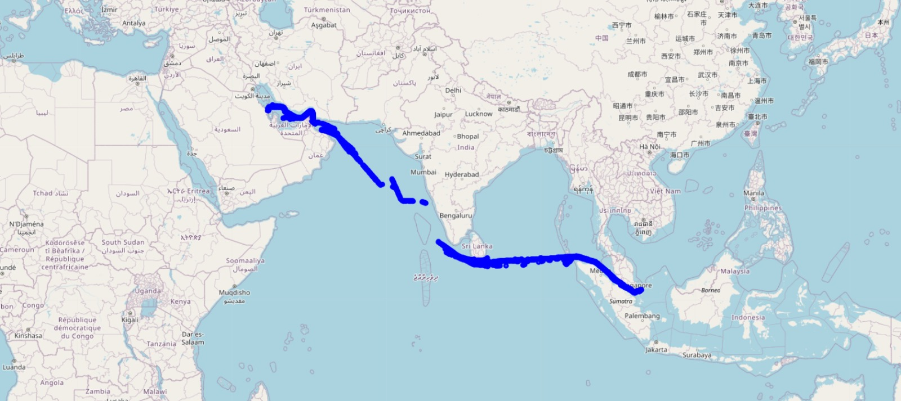
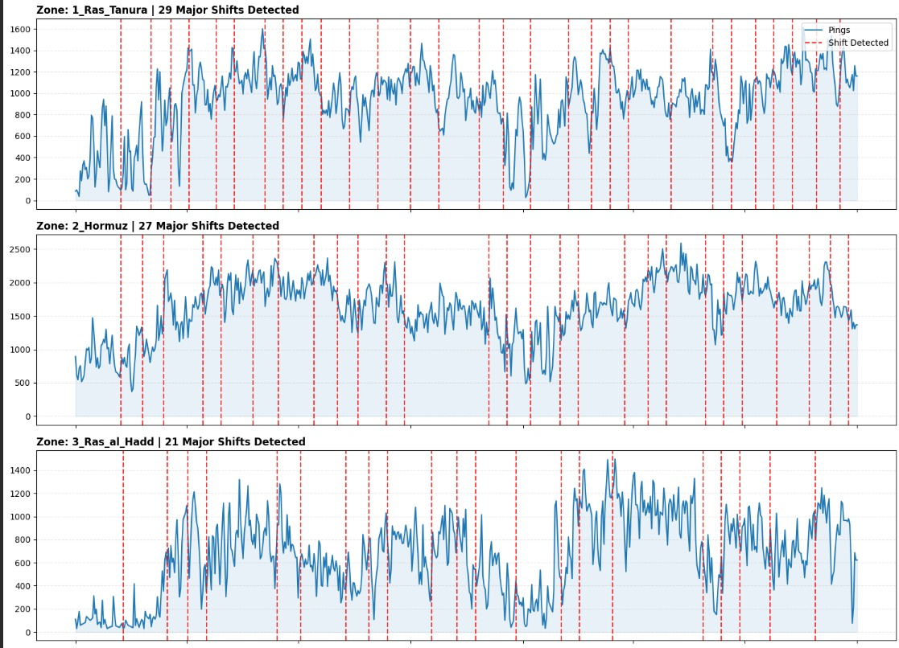
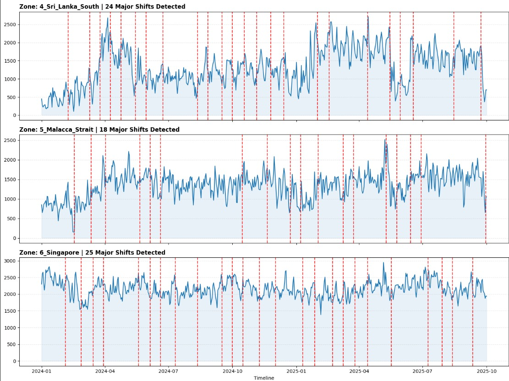
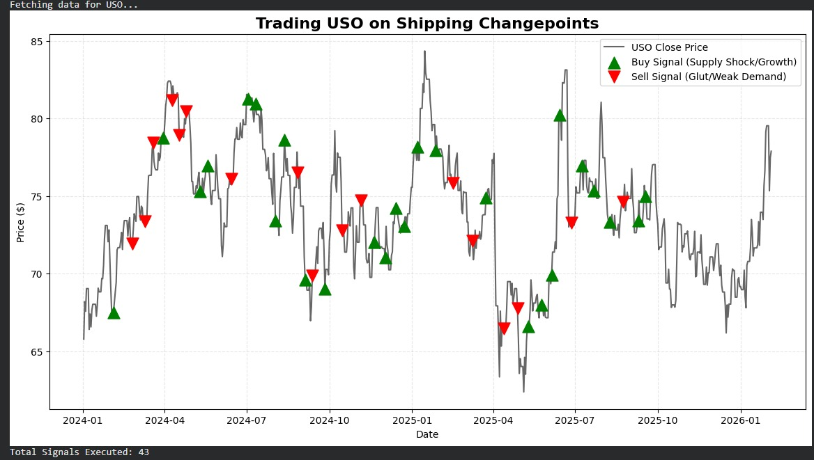
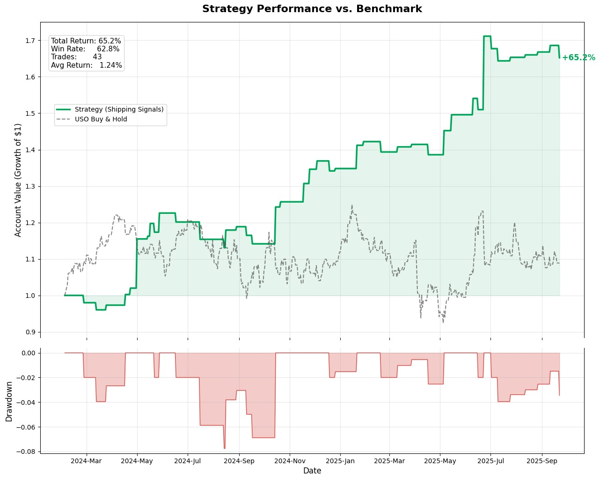
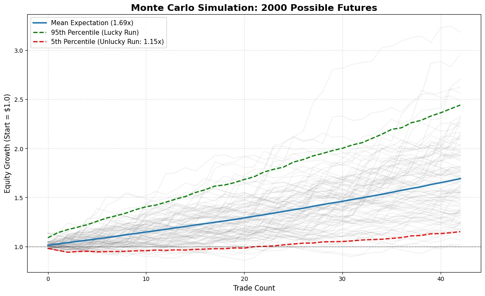

# Shipping Changepoint-Driven Oil Trading Strategy

This repository contains a research prototype that links online changepoint detection (FOCuS) in global shipping activity to directional trading signals in crude-oil-linked assets (USO ETF).

The core idea is that structural changes in vessel activity across key maritime chokepoints can act as early indicators of supply-demand imbalances, which may precede price movements in oil markets.

---

## Global Shipping Routes Analysed

<p align="center">
  
</p>

---

## Project Overview

The pipeline consists of five main stages:

1. Online changepoint detection on shipping activity by region  
2. Aggregation of regional events into global supply-demand shocks  
3. Signal construction using short- versus long-term momentum in flows  
4. Trade simulation with explicit risk management  
5. Monte Carlo analysis to assess robustness and sequence risk  

---

## Data Sources

### Shipping Data

- Time-bucketed (30-minute or daily) vessel activity  
- Aggregated by strategic regions  
- Retrieved via Datelastic API  

<p align="center">
  
</p>

<p align="center">
  
</p>

### Market Data

- USO ETF daily prices  
- Retrieved via the Polygon API  

---

## Methodology

### Changepoint Detection

```python
{ region: [changepoint_dates] }
```

### Signal Generation

```
Net Flow = Demand change - Supply change
```

---

## Trading Strategy

<p align="center">
  
</p>

---

## Strategy Performance

<p align="center">
  
</p>

---

## Monte Carlo Simulation

<p align="center">
  
</p>

---

## Disclaimer

This project is for research and educational purposes only.